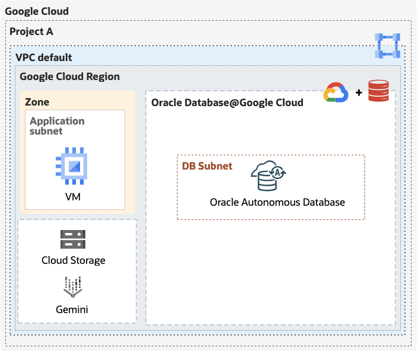

# Oracle Database@Google Cloud: Create an Autonomous Database
There are different ways that you can deploy a new Oracle Autonomous Database:
* [Using the Google Cloud Portal](https://docs.oracle.com/en-us/iaas/ogadb/ogadb-provisioning-autonomous-database.html)
* [Using Terraform scripts](https://github.com/oci-landing-zones/terraform-oci-multicloud-azure)
* Using the Google Command Line Interace (gcloud CLI)


The steps below show how to create an Autonomous Database using the gcloud CLI. 

## Prerequisites:
* [Install the gcloud CLI](https://cloud.google.com/sdk/docs/install) 
* [Onboard Oracle Database@Google Cloud](https://docs.oracle.com/en-us/iaas/Content/database-at-gcp/oagcp-onboard.htm#oagcp_onboard). Onboarding includes subscribing to the service using a Pay as You Go or private offer, setting up permissions, and more. 

## Deploy your Autonomous Database and your infrastructure
The gcloud CLI scripts will deploy the following infrastructure:
* A VPC Network with a client subnet
* An Oracle Autonomous Database. It is deployed to a private subnet on that VPC Network. That private subnet is managed by Oracle Database@Google Cloud.
* A Windows-based Virtual Machine is deployed to the client subnet. You can RDP to that VM to develop your apps and access Autonomous Database.
* A Cloud Storage bucket with sample data
* Sample code will use Google Gemini. Ensure the API is enabled.




**Note:** Gemini is used by the samples - but the scripts do not set up access to the resource. See the [Generative AI on Vertex Quickstart](https://cloud.google.com/vertex-ai/generative-ai/docs/start/quickstarts/quickstart-multimodal?authuser=1)

You can run the scripts independently or run `create-all-resources.sh`. Simply update the [`config`](#configuration-file) prior to running the scripts:

|Script|Description|
|----|---|
|[create-network.sh](create-network.sh)|Creates a VPC Network and subnet with required firewall rules. ADB is accessed thru a private endpoint on this network. The VM is deployed to this network and can be used to work with ADB.|
|[create-adb.sh](create-adb.sh)|Create an Autonomous Database|
|[create-compute-vm.sh](create-compute-vm.sh)|Create a VM in that VPC. By default, a Windows VM is created and can be accessed via RDP. After running this script, you can set up the password by running: <br>`source config`<br>`gcloud compute reset-windows-password $VM_NAME --zone=$REGION-a`|
|[create-all-resources.sh](create-all-resources.sh)|Creates your network, ADB, VM and Cloud Storage bucket.|
|[create-data-lake-storage.sh](create-data-lake-storage.sh)|Creates a bucket on Cloud Storage and uploads sample data into that bucket|
|[delete-all-resources.sh](delete-all-resources.sh)|Deletes your resource group, network, ADB and VM|
|[show-adb-info.sh](show-adb-info.sh)|Shows information about your ADB - including you JDBC connection details to the HIGH service|
|[show-data-lake-storage-info.sh](show-data-lake-storage-info.sh)|Shows information about your data lake storage - including the storage endpoint URL|

### Configuration file
The gcloud CLI deployment scripts rely on settings found in the config file. These resources **will be created** by the scripts. Update the config file prior to running any of the scripts. 

>**IMPORTANT:** This file will contain a password that is used to connect to Autonomous Database and the virtual machine. Set the file's permissions so that only the file's owner can view its contents:
```bash
chmod 600 config
```

|Setting|Description|Example|
|----|----|----|
|REGION|Region where resources will be deployed. [See documentation](https://docs.oracle.com/en-us/iaas/Content/database-at-gcp/oagcp-regions.htm) for region availability|"us-east4"|
|PROJECT|Target Google Cloud project for new resources|"development"|
|USER_PASSWORD|The password for the Autonomous Database admin user|"watchS0meMovies#"|
|ADB_NAME|Autonomous Database name. This name must be unique within a region location|"quickstart"|
|SUBNET_DB_IP_RANGE|IP address range used for ADB. It can not overlap with the client subnet range. It can overlap with other ADB instances.|"192.168.11.0/24"|
|VPC_NETWORK_NAME|Name of the VPC Network|"dev-network"|
|VNET_PREFIX|CIDR range for the virtual network|"192.168.0.0/16"|
|SUBNET_CLIENT_NAME|Name of the client subnet where the VM is deployed|"dev-sn-client"|
|SUBNET_CLIENT_IP_RANGE|CIDR range for the client subnet|"192.168.10.0/24"|
|VM_NAME|Name of the virtual machine|"dev-vm-client"|
|VM_IMAGE_FAMILY|The image deployed to the VM |"windows-2022"|
|VM_MACHINE_TYPE|The type of VM deployed|"e2-standard-4"|
|BUCKET_NAME|The name of the cloud storage bucket where sample files will be uploaded.|"adb-sample-quickstart"|


### Using the scripts
Make sure that you have enabled APIs for your project. [See the documentation](https://cloud.google.com/endpoints/docs/openapi/enable-api) for details. 

Log into Google Cloud from the CLI: 
```bash
gcloud auth login 
```

Update the config file
Then, run your scripts. The following will deploy a complete environment, but you can also install independent components. Just make sure you install dependencies (e.g. a VCN prior to Autonomous Database):

Creating all of the resources will take approximately 15-20 minutes.

```bash
./create-all-resources.sh
```

Check for errors after running the script. For example, VM availability can impact the success of creating the resource. If there is an issue, simply rerun the script that creates the resource (note: you may need to update the config file).

## What's next
Connect to your Autonomous Database!
* [Learn about connectivity options](https://docs.oracle.com/en/cloud/paas/autonomous-database/serverless/adbsb/connect-preparing.html)
* Use these great VS Code extensions that help you develop and debug your database apps:
    * SQL Developer for VS Code ([Learn More](https://www.oracle.com/database/sqldeveloper/vscode/) | [Marketplace](https://marketplace.visualstudio.com/items?itemName=Oracle.sql-developer))
    * Oracle Developer Tools for VS Code  ([Learn More](https://docs.oracle.com/en/database/oracle/developer-tools-for-vscode/getting-started/gettingstarted.html) | [Marketplace](https://marketplace.visualstudio.com/items?itemName=Oracle.oracledevtools)) 
* [Use the sample scripts](../../sql/README.md) to learn how to use different features - like Select AI, data lake integration, JSON, and more.


#### JDBC Example:
JDBC is a common way to connect to Autonomous Database. For example, you can use the **Custom JDBC URL** in the VS Code SQL Developer Extension:
    

Notice the `jdbc:oracle:thin:@` prefix followed by a connection string. You can find the connection string in different ways. 

1. Go to your Autonomous Database blade in the Azure Portal and go to **Settings -> Connections**:
    
2. Use the Azure cli script [`show-adb-info.sh`](./show-adb-info.sh). That script will return information about your Autonomous Database, including connection details.

<hr>
Copyright (c) 2024 Oracle and/or its affiliates.<br>
Licensed under the Universal Permissive License v 1.0 as shown at https://oss.oracle.com/licenses/upl/
